# SystemMonitor Technical Documentation

## Table of Contents
1. [Overview](#overview)
2. [Architecture](#architecture)
3. [Class Diagrams](#class-diagrams)
4. [Activity Diagrams](#activity-diagrams)
5. [Sequence Diagrams](#sequence-diagrams)
6. [State Diagrams](#state-diagrams)
7. [Component Interactions](#component-interactions)
7. [Data Flow](#data-flow)
8. [Configuration Management](#configuration-management)
9. [Threading Model](#threading-model)
10. [Error Handling](#error-handling)

## Overview

SystemMonitor is a professional C++ Windows system monitoring application designed with object-oriented principles and enterprise-grade architecture. The application provides real-time system monitoring, email alerting, and multiple display modes for different operational scenarios.

### Key Features
- Real-time CPU, RAM, and Disk monitoring
- Process-level resource tracking with aggregation
- TLS-encrypted email notifications via libcurl
- Multiple display modes (line, top, compact, silence)
- Asynchronous logging with rotation
- Comprehensive configuration management
- Professional email alerting with recovery notifications

## Architecture

The application follows a layered architecture pattern with clear separation of concerns:

```
┌─────────────────────────────────────────────────────────────┐
│                    Presentation Layer                       │
│  ┌─────────────────┐  ┌─────────────────┐  ┌──────────────┐ │
│  │  Console UI     │  │  Display Modes  │  │  Key Handler │ │
│  │  (main.cpp)     │  │  (Line/Top/     │  │              │ │
│  │                 │  │  Compact/Silent)│  │              │ │
│  └─────────────────┘  └─────────────────┘  └──────────────┘ │
└─────────────────────────────────────────────────────────────┘
┌─────────────────────────────────────────────────────────────┐
│                     Business Layer                          │
│  ┌─────────────────┐  ┌─────────────────┐  ┌──────────────┐ │
│  │ SystemMonitor   │  │ ProcessManager  │  │ EmailNotifier│ │
│  │                 │  │                 │  │              │ │
│  └─────────────────┘  └─────────────────┘  └──────────────┘ │
└─────────────────────────────────────────────────────────────┘
┌─────────────────────────────────────────────────────────────┐
│                   Infrastructure Layer                      │
│  ┌─────────────────┐  ┌─────────────────┐  ┌──────────────┐ │
│  │  Configuration  │  │     Logger      │  │ SystemMetrics│ │
│  │   Management    │  │   (Async)       │  │  (Windows)   │ │
│  └─────────────────┘  └─────────────────┘  └──────────────┘ │
└─────────────────────────────────────────────────────────────┘
```

## Class Diagrams

### Core Architecture Class Diagram

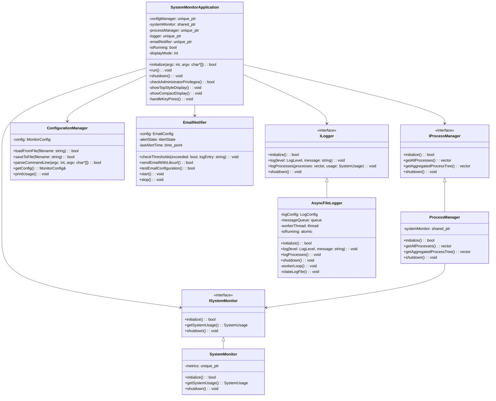

### Configuration Management Class Diagram

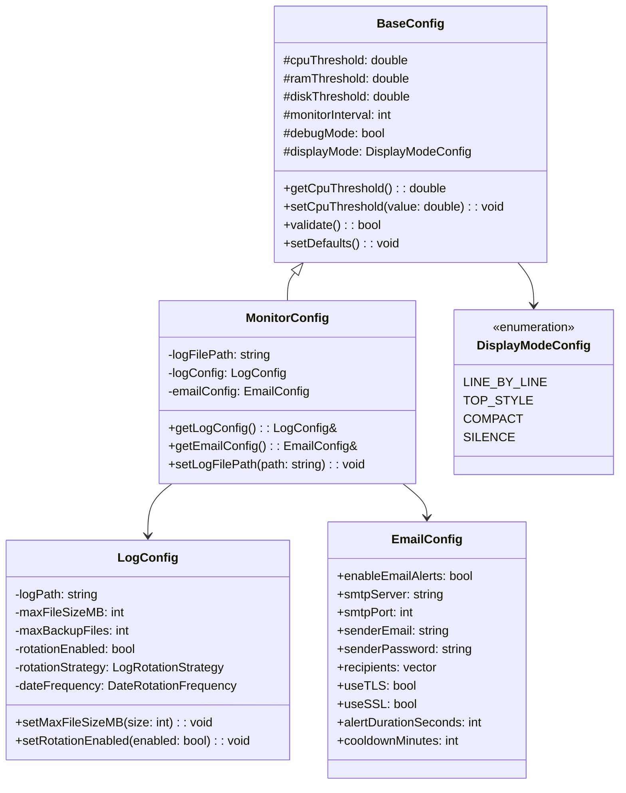

### Data Models Class Diagram

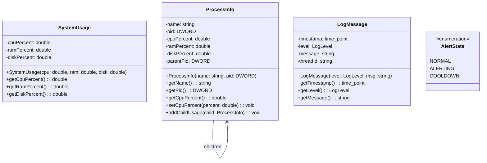

## Activity Diagrams

### Application Startup Activity Diagram

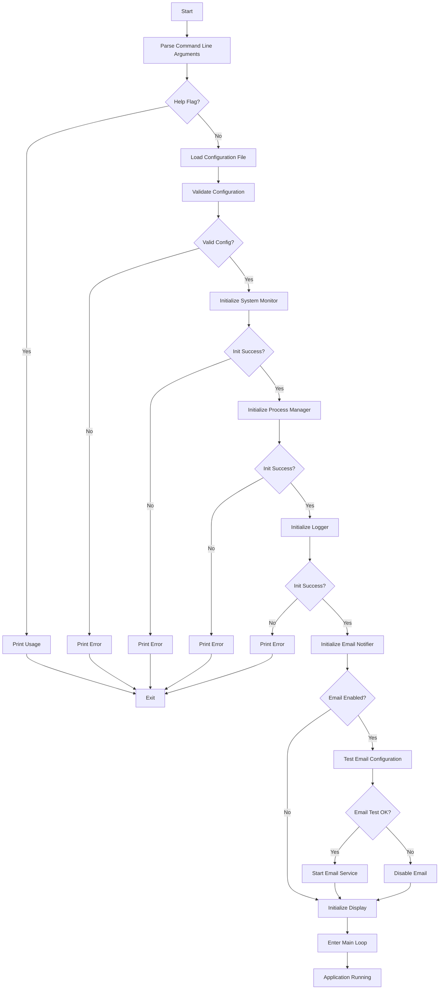

### Main Monitoring Loop Activity Diagram

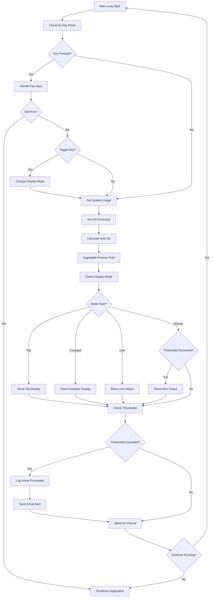

### Email Alert Processing Activity Diagram

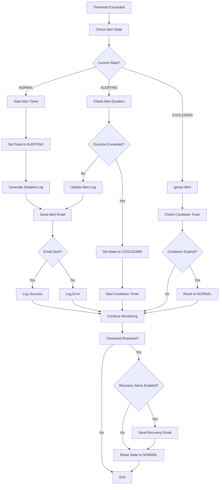

## Sequence Diagrams

### Application Initialization Sequence

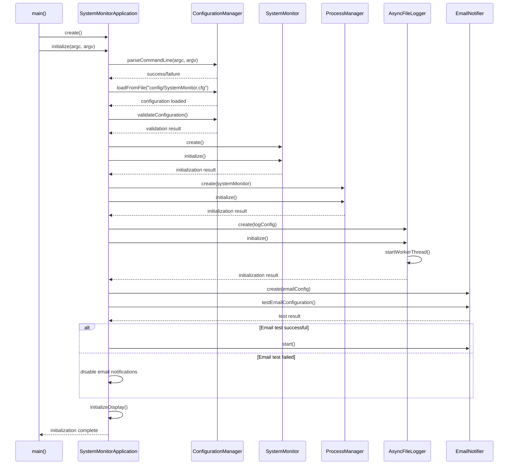

### Monitoring Cycle Sequence

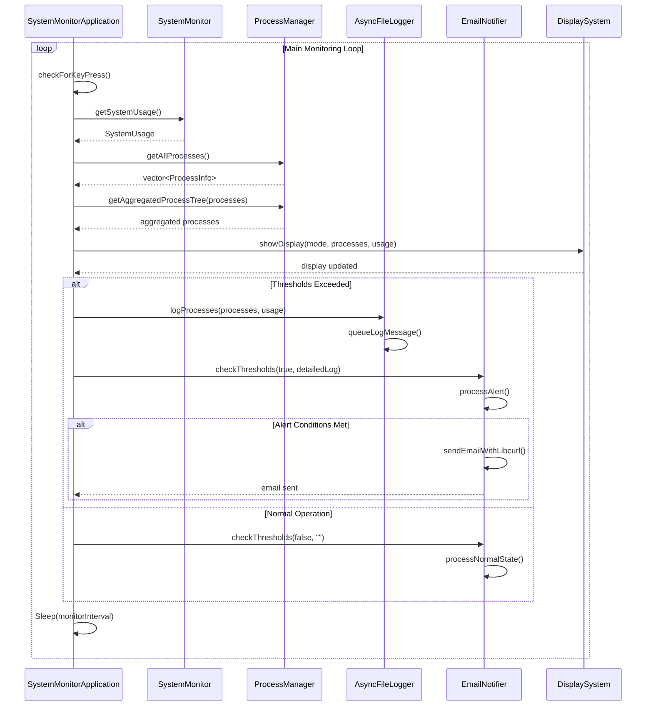

### Email Alert Sequence

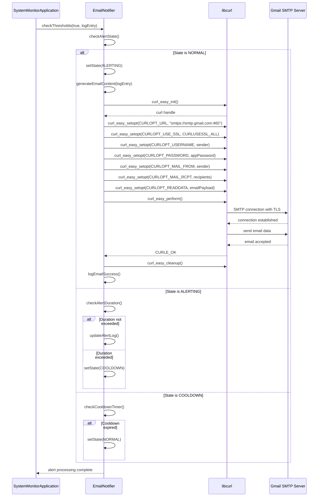

### Asynchronous Logging Sequence

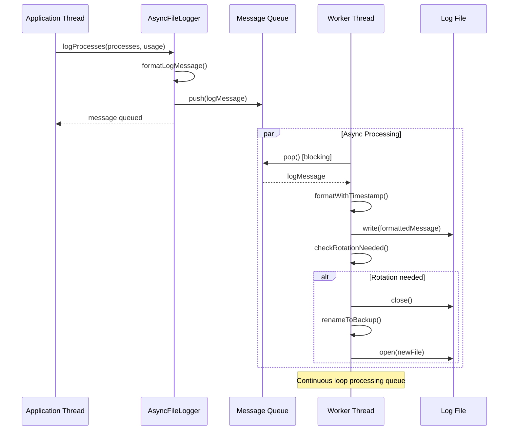

## State Diagrams

### Application State Machine

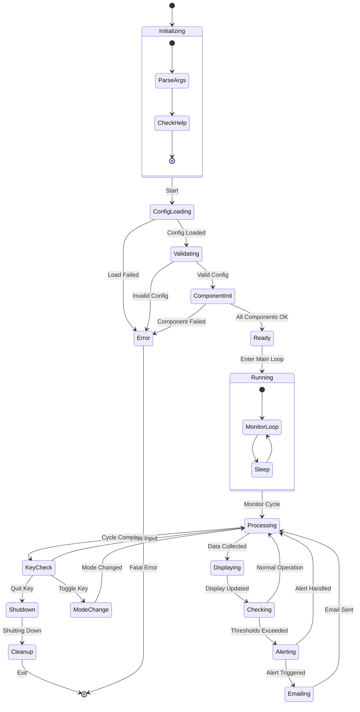

### Email Alert State Machine

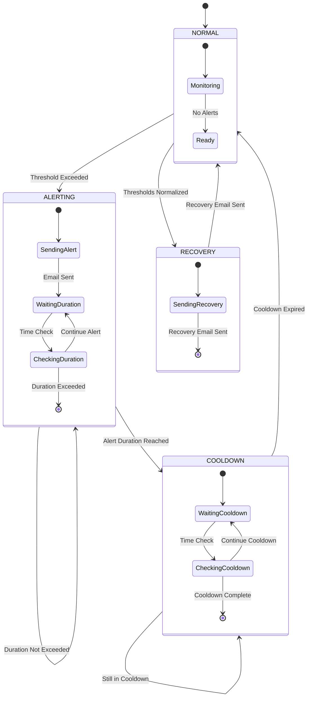

### Display Mode State Machine

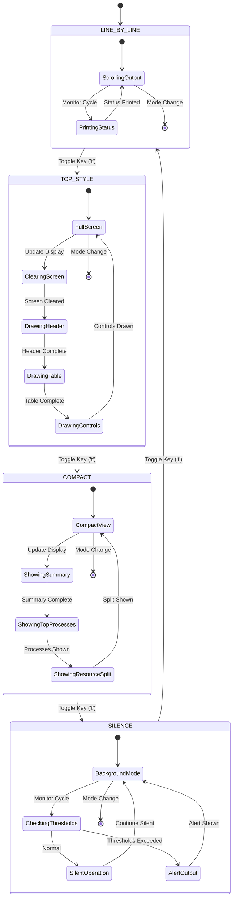

### Logger State Machine

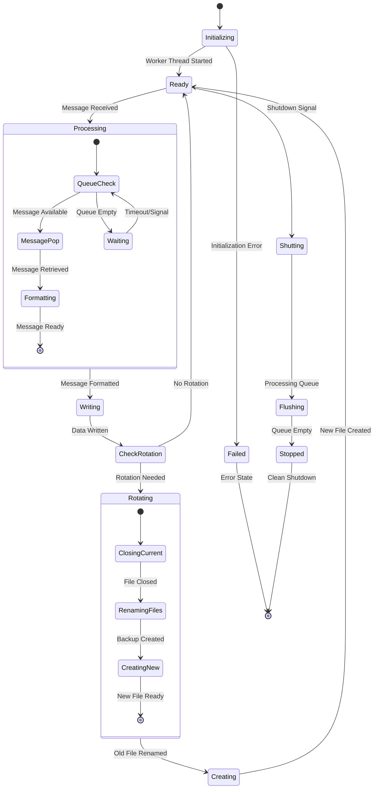

### System Monitor Component States

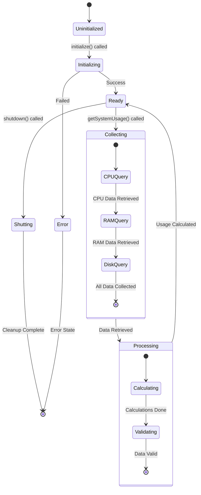

### Process Manager State Machine

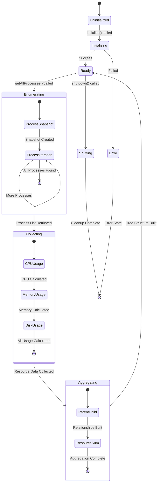

### Configuration Loading State Machine

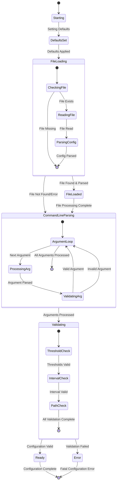

## Component Interactions

### Display Mode Architecture

The application supports four display modes, each optimized for different use cases:

1. **Line Mode**: Traditional scrolling output
2. **Top Mode**: Interactive full-screen display (like Linux htop)
3. **Compact Mode**: Space-efficient table view
4. **Silence Mode**: Background monitoring with alerts only

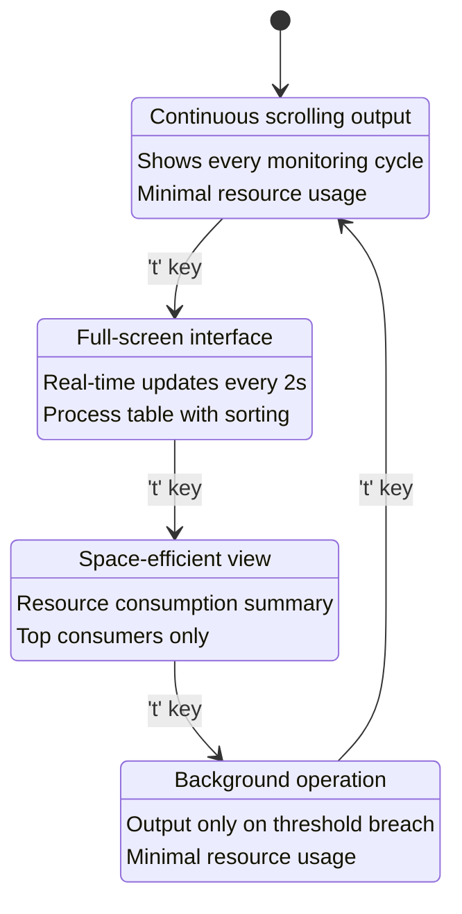

### Threading Model

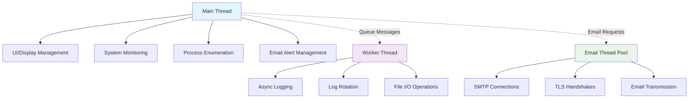

## Data Flow

### System Metrics Collection Flow

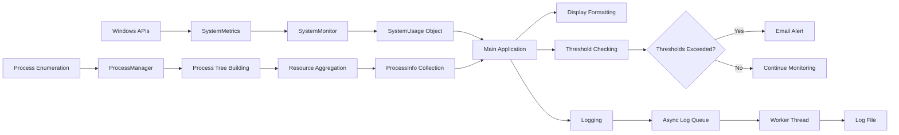

### Configuration Loading Flow

```mermaid
flowchart TD
    A[Application Start] --> B[Command Line Parsing]
    B --> C[Default Values]
    C --> D[Config File Loading]
    D --> E[Command Line Override]
    E --> F[Validation]
    F --> G{Valid?}
    G -->|Yes| H[Configuration Ready]
    G -->|No| I[Error & Exit]
    
    H --> J[System Initialization]
    J --> K[Runtime Configuration]
    K --> L[Save Updated Config]
```

## Configuration Management

### Configuration Hierarchy

1. **Default Values** (lowest priority)
2. **Configuration File** (`config/SystemMonitor.cfg`)
3. **Command Line Arguments** (highest priority)

### Configuration Loading Process

```cpp
// Pseudo-code for configuration loading
class ConfigurationManager {
    bool initialize(int argc, char* argv[]) {
        // Step 1: Set defaults
        config.setDefaults();
        
        // Step 2: Load from file (if exists)
        if (fileExists("config/SystemMonitor.cfg")) {
            loadFromFile("config/SystemMonitor.cfg");
        }
        
        // Step 3: Override with command line
        parseCommandLine(argc, argv);
        
        // Step 4: Validate final configuration
        return config.validate();
    }
};
```

## Threading Model

### Main Thread Responsibilities
- User interface management
- Keyboard input handling
- System metrics collection
- Process enumeration
- Email alert coordination
- Display mode management

### Worker Thread (AsyncFileLogger)
- Message queue processing
- File I/O operations
- Log rotation management
- Thread-safe logging operations

### Thread Safety Mechanisms
- Atomic variables for thread coordination
- Message queues for async communication
- RAII for resource management
- Proper shutdown synchronization

## Error Handling

### Error Handling Strategy

1. **Graceful Degradation**: Non-critical failures don't stop the application
2. **Comprehensive Logging**: All errors are logged with context
3. **User Notification**: Critical errors are displayed to the user
4. **Recovery Mechanisms**: Automatic retry for transient failures

### Error Categories

#### System-Level Errors
- Process enumeration failures
- Performance counter access issues
- Memory allocation failures

#### Configuration Errors
- Invalid configuration values
- Missing configuration files
- Permission issues

#### Network Errors
- SMTP connection failures
- TLS handshake errors
- DNS resolution issues

#### File System Errors
- Log file write failures
- Disk space issues
- Permission denied

### Error Handling Flow

```mermaid
flowchart TD
    A[Error Detected] --> B{Error Type?}
    B -->|Critical| C[Log Error]
    B -->|Warning| D[Log Warning]
    B -->|Info| E[Log Info]
    
    C --> F[Notify User]
    D --> G[Continue Operation]
    E --> G
    
    F --> H{Recoverable?}
    H -->|Yes| I[Attempt Recovery]
    H -->|No| J[Graceful Shutdown]
    
    I --> K{Recovery Success?}
    K -->|Yes| G
    K -->|No| J
    
    G --> L[Continue Monitoring]
    J --> M[Exit Application]
```

---

## Conclusion

The SystemMonitor application demonstrates professional software architecture with clear separation of concerns, robust error handling, and extensible design patterns. The modular design allows for easy maintenance and future enhancements while providing reliable system monitoring capabilities.

### Key Architectural Benefits

1. **Modularity**: Each component has well-defined responsibilities
2. **Extensibility**: Interface-based design allows for easy component replacement
3. **Scalability**: Asynchronous processing prevents blocking operations
4. **Maintainability**: Clear class hierarchies and documented interfaces
5. **Reliability**: Comprehensive error handling and graceful degradation
6. **Performance**: Efficient resource usage and optimized display modes

The technical implementation showcases modern C++ practices, Windows API integration, and professional software development patterns suitable for enterprise environments.
